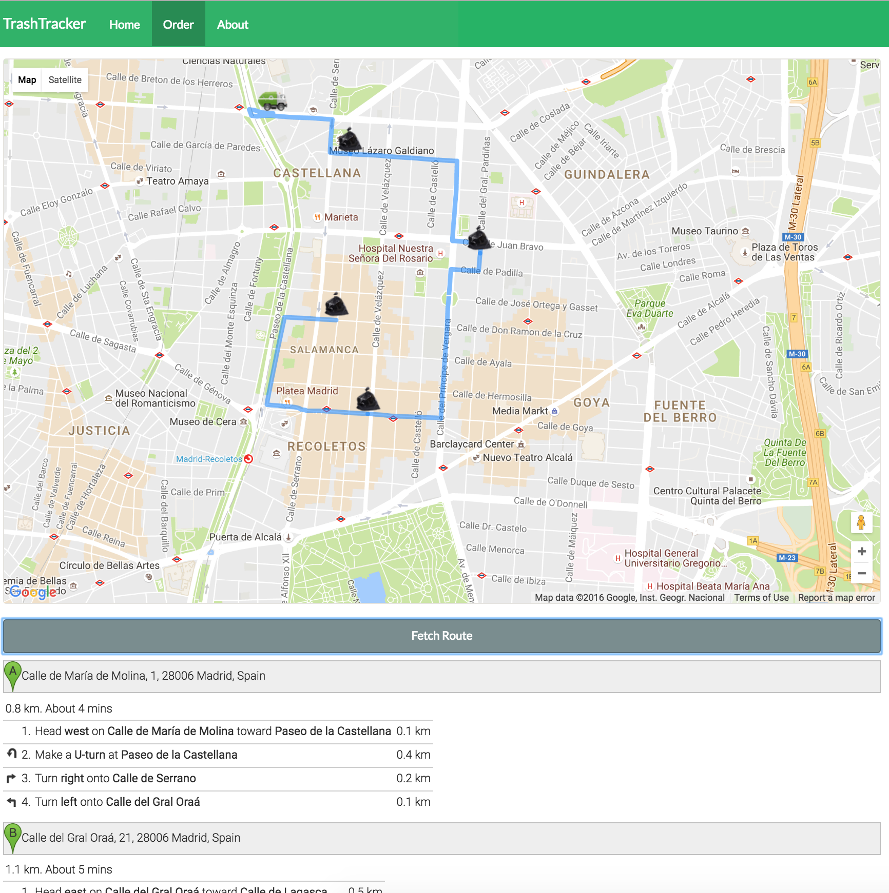

##Trashtracker
This is the repository for the frontend code of Trashtracker, a project for [Ennomotive's Industry #Hackathon 4.0](http://www.ennomotive.com/hackathon/) held at IE Busniess school's Block 31.

[Demo Page](https://rawgit.com/Porco-Rosso/Trashtracker-Hackathon/master/index.html)

  

  

  

